# MiniVLA-NAV

  <h2>Mini Vision-Language-Action Navigation with CLIP and PyBullet</h2>
  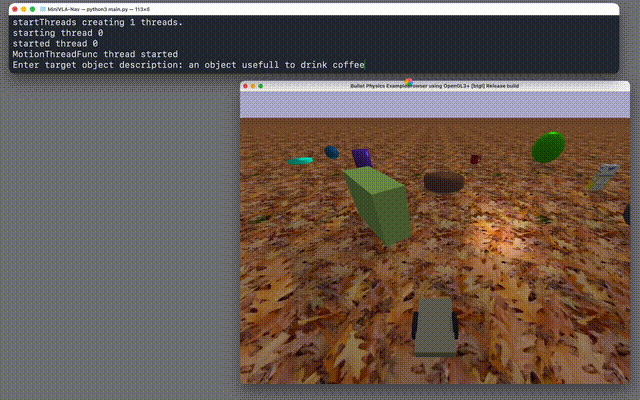
<h4>Given prompt: "an object useful to drink coffee"</h4>

  
  
  

---

## Overview

**MiniVLA-NAV** is a **Mini Vision-Language-Action (VLA)** project I created to start experimenting with embodied navigation guided by a **Vision-Language Model (VLM)**.  
The system uses **OpenAI CLIP (ViT-B/32)** to connect text and perception: the robot receives a natural-language prompt, analyzes its camera feed, and navigates toward the region that best matches the description.  

The entire environment — robot, world, textures, and objects — is built procedurally in **PyBullet**.  
The goal is to explore how a pretrained vision-language model can produce primitive navigation behavior without explicit object detection or reinforcement learning.

---

## Key Characteristics

- **Robot:** Differential-drive robot created procedurally (no URDF dependency)  
- **Vision Language Model:** OpenAI CLIP (ViT-B/32) used as a perception backbone  
- **Action Expert:** Simple cosine-based navigation (sector-wise scoring + smooth motion)  
- **Environment:** PyBullet scene with random YCB objects, shapes, and textures  
- **Goal:** Reach the visual area corresponding to a given natural-language prompt  
---

## How It Works

At each simulation step:

1. The robot captures an RGB frame from its onboard camera.  
2. The image is split into *K* vertical sectors.  
3. Each sector is encoded using CLIP’s image encoder.  
4. The cosine similarity with the text embedding determines relevance.  
5. The sector with the highest score defines the heading.  
6. Forward velocity is scaled by similarity confidence.  
7. The robot moves smoothly toward the most semantically aligned region.

This setup forms a **minimal VLA loop**: language → vision → action.

---

## Architecture Schema

            +-----------------------------+
            |        Text Prompt          |
            |   e.g. "a red ball"         |
            +-------------+---------------+
                          |
                          v
            +-------------+---------------+
            |     CLIP Text Encoder       |
            |   (ViT-B/32 → embedding)    |
            +-------------+---------------+
                          |
                          v
    +----------------------------------------------+
    |              CLIP Navigation Loop            |
    | 1. Capture RGB frame                         |
    | 2. Split into K vertical sectors              |
    | 3. Encode each crop with CLIP Image Encoder   |
    | 4. Compare to text embedding (cosine score)   |
    | 5. Select argmax sector                      |
    | 6. Compute (v, ω) commands                   |
    +----------------------------------------------+
                          |
                          v
            +-------------+-------------+
            | PyBullet Differential Bot |
            +-------------+-------------+
                          |
                          v
            +-------------+-------------+
            |  Environment Update (GUI) |
            +---------------------------+

---

## Parameters

| Parameter | Description | Default |
|------------|-------------|----------|
| `K` | Number of image sectors | 9 |
| `fov_deg` | Camera field of view | 120° |
| `v_max` | Maximum forward velocity | 15.0 |
| `w_gain` | Angular velocity gain | 7.5 |
| `conf_th` | Confidence threshold | 0.08 |
| `SMOOTH_v` | Velocity smoothing factor | 0.15 |
| `SMOOTH_w` | Angular smoothing factor | 0.05 |

---
## Demo Gallery (GIFs)

The project demonstrates strong performance on both **simple prompts** such as *"a red ball on the ground"*, where the robot consistently moves toward the target, and on **more abstract or relational prompts** like *"the opposite of an apple"* (successfully identifying a pear) or *"an object useful to drink coffee"* (finding a mug). It even generalizes to compositional descriptions such as *"a ball that has the same color as the sun"*, correctly selecting a yellow sphere.  

The algorithm can also exhibit **exploratory behavior**, as illustrated in the *"orange mug on the grass"* example, where the robot actively scans its surroundings to locate the object when it is not immediately visible.

| | |
|------|------|
| 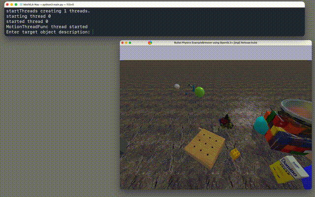 <i>Prompt: "a baseball"</i> |  <i>Prompt: "an object useful to drink coffee"</i> |
| 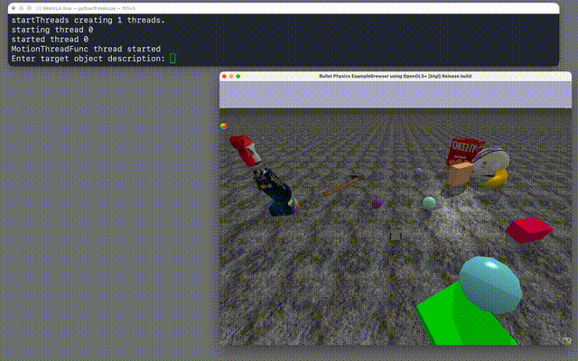 <i>Prompt: "crackers"</i> | 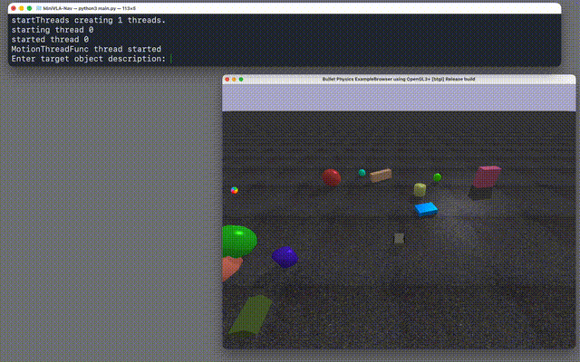 <i>Prompt: "a small cyan ball on the ground"</i> |
| 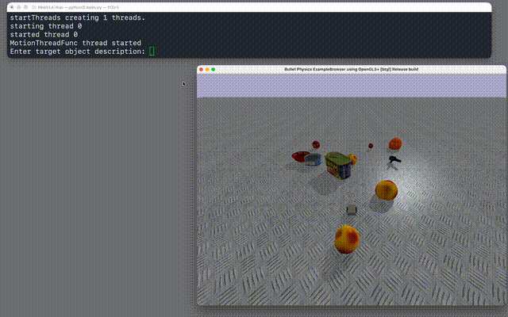 <i>Prompt: "find the biggest fruit"</i> | 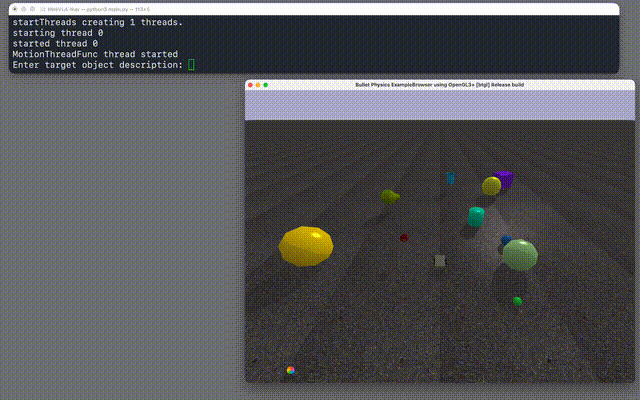 <i>Prompt: "the opposite of an apple"</i> |
| 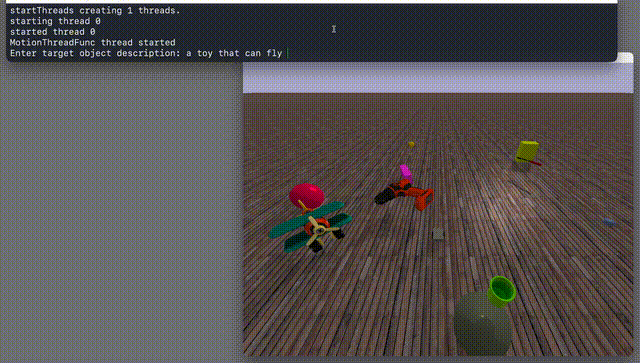 <i>Prompt: "a toy that can fly"</i> | 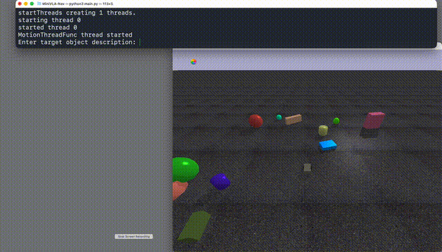 <i>Prompt: "big red ball on the ground"</i> |
| 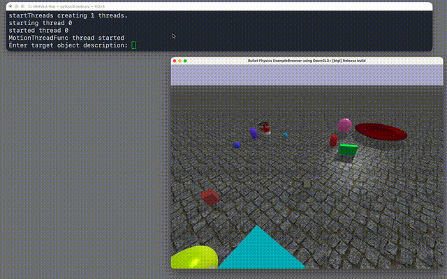 <i>Prompt: "an object that contains sauce"</i> | 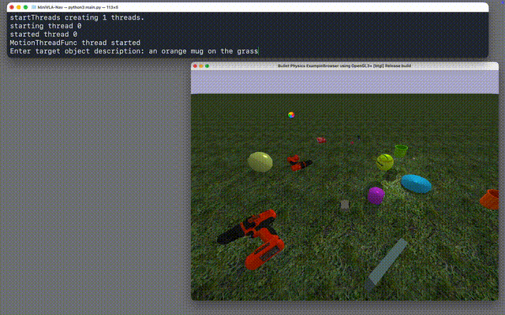 <i>Prompt: "an orange mug on the grass"</i> |
| 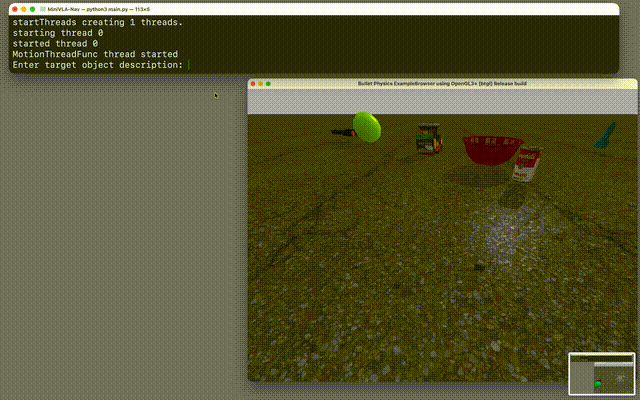 <i>Prompt: "a ball that has the same color as the sun"</i> |  |

---
## Installation

git clone https://github.com/rantaluca/MiniVLA-NAV.git
cd MiniVLA-NAV
pip install pybullet torch torchvision matplotlib pillow
pip install git+https://github.com/openai/CLIP.git

Python ≥ 3.9 is recommended.

---

## Running the System

### To test the agent:
python main.py

Then type a prompt when requested, the prompt should be the target object description: "a red ball on the ground"

### To visualize the environment:
python env.py –gui –n_objects 20

## Notes
- The project is intentionally lightweight: no RL training or external datasets.   
- The world generation can be deterministic when a seed is provided.  
